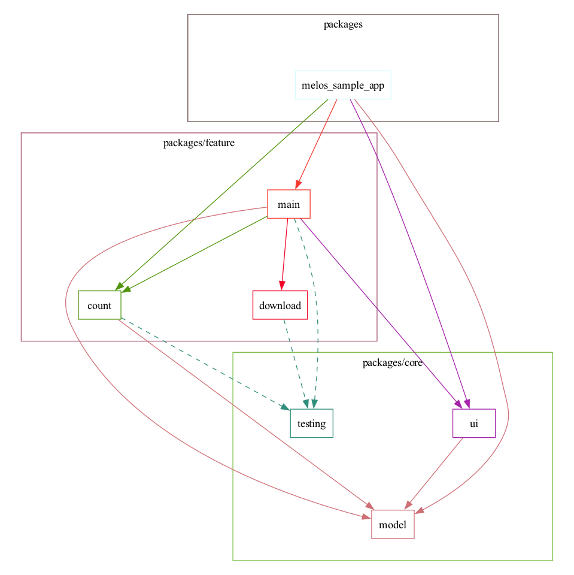

# Melos Sample App

A Sample App using **Melos**.

[Melos ducument](https://melos.invertase.dev/)

This App comprises:

- Multi package structure using Melos
- A basic UI showing, increasing and decreasing the counter

## Dependencies

as Image...


as Json...

```json
{
  "count": [
    "model",
    "testing"
  ],
  "download": [
    "testing"
  ],
  "main": [
    "count",
    "model",
    "ui",
    "download",
    "testing"
  ],
  "melos_sample_app": [
    "main",
    "model",
    "ui",
    "count"
  ],
  "model": [],
  "testing": [],
  "ui": [
    "model"
  ]
}
```

## Installation

1. If you do not have [Melos](https://melos.invertase.dev/getting-started#installation) or [FVM](https://fvm.app/docs/getting_started/installation/#standalone) installed, you need to install them first.

2. Clone the repository:

    ```sh
    git clone https://github.com/kktaro/melos_sample.git
    ```

3. Install Flutter SDK for FVM:

    ```sh
    fvm install
    ```

4. Run melos bootstrap:

    ```sh
    melos bootstrap
    ```

    or

    ```sh
    melos bs
    ```

5. Run Flutter app
